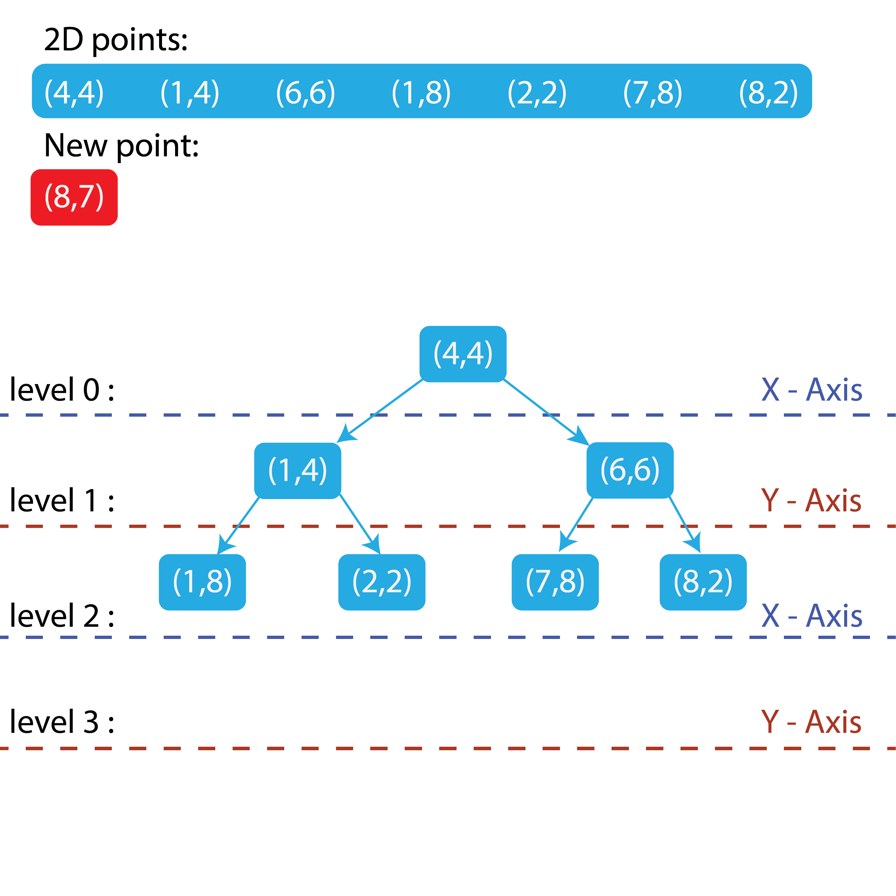

## Proposal - KD Trees for Finding the Nearest Neighbor

### What is a KD Tree? 
  
A KD Tree (k-dimensional tree) is a binary search tree used for organizing and searching points in a k-dimensional space. One of its application is performing nearest neighbor searches in k dimensions.
  

Here is an example of a KD tree: 

  

### How it works  

Given *N* points with dimension *K*, the tree is organized by cycling through the axes of the dimensions at each level.  

Using the example above:  

For a set of 7 points in 2 dimensions, the tree functions like a regular binary tree but alternates the axis used for comparison at each level.

* First the first point will be the root node
* From here the next point will be are organized using one dimension at a time, with the axis determined by the level of the tree (Level mod 𝐾)

For new point (8,7): *Left if Smaller And Right if Greater or equal*

Node→ Right→ Right→ Right 
Becoming a new leaf node 

This is way we can quadrant points like so: 

Create a O(logn) search at best for nearest neighbor. 

### Application of KD Tree

Create a solution to semi-automate the Circuit runs between strobe ckt to create an optimal loss of voltage with the use of K-D Tree as the algorthim.

    

<h3> Problem </h3> 

    Given a set of <b>STROBES</b> (devices used in fire alarm systems to visually notify occupants in the case of a fire) with <b>X, Y, Z</b> coordinates.

    We need to find the most optimal circuit run that will have the lowest voltage drop by connecting the closest strobe in a series.

    Then, use that circuit in a CAD drawing to create a technical drawing that can be followed in the field.

<h3>Key Points</h3>
    <ol>
        <li>
            <b>Starting location</b> - The initial node point, which is the location of the fire alarm panel.
        </li>
        <li>
            <b>Circuit run</b> - The circuit will follow from the Panel (FACP/NAC) to the closest strobe (device).
        </li>
        <li>
            Continue to the next closest device until all devices have been addressed to complete the circuit run.
        </li>
        <li>
            <i>Future implementation</i> - Circuit runs will alternate "A/B" to comply with NFPA code requirements.
        </li>
    </ol>

<figure style="height: 100%; display: flex; flex-direction: column; align-self: center; justify-content: center; ">
    
    <figcaption style="text-align:center">Diagram of Strobe -green-, Panel and circuit </figcaption>
</figure>

 

 

 