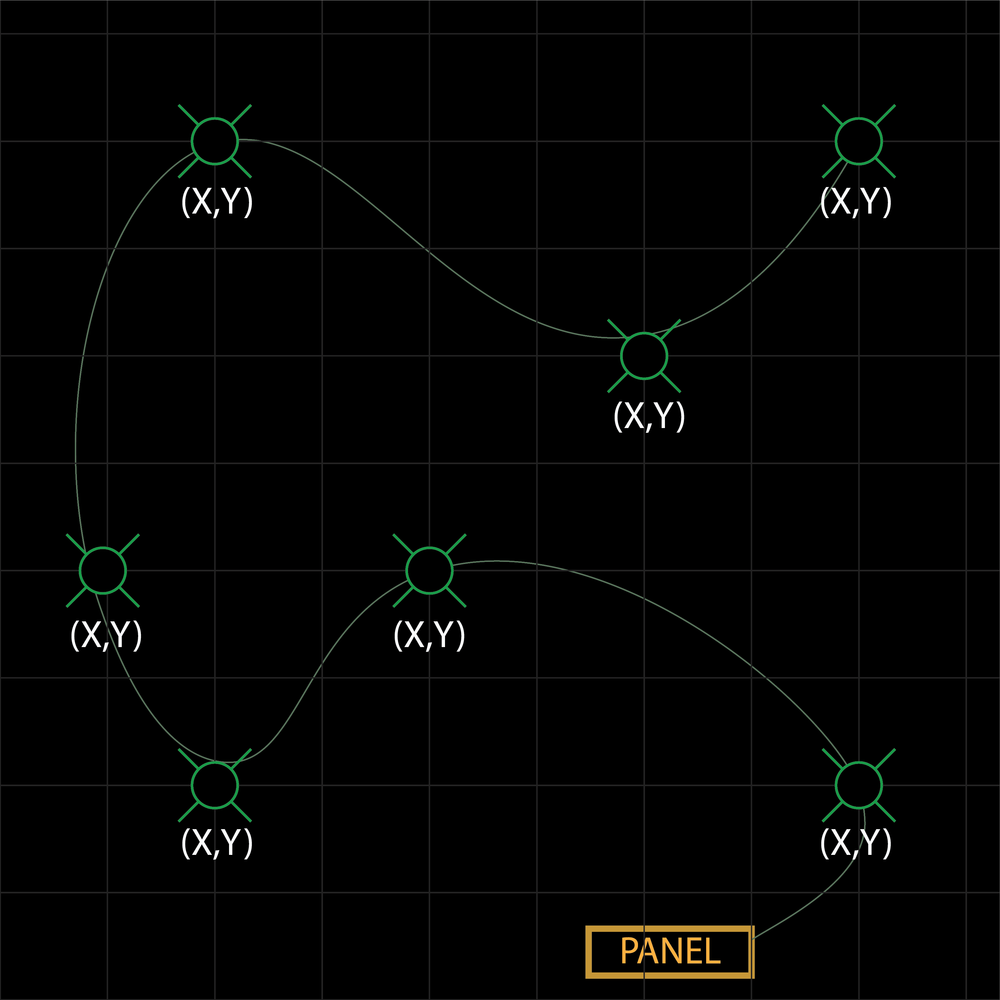
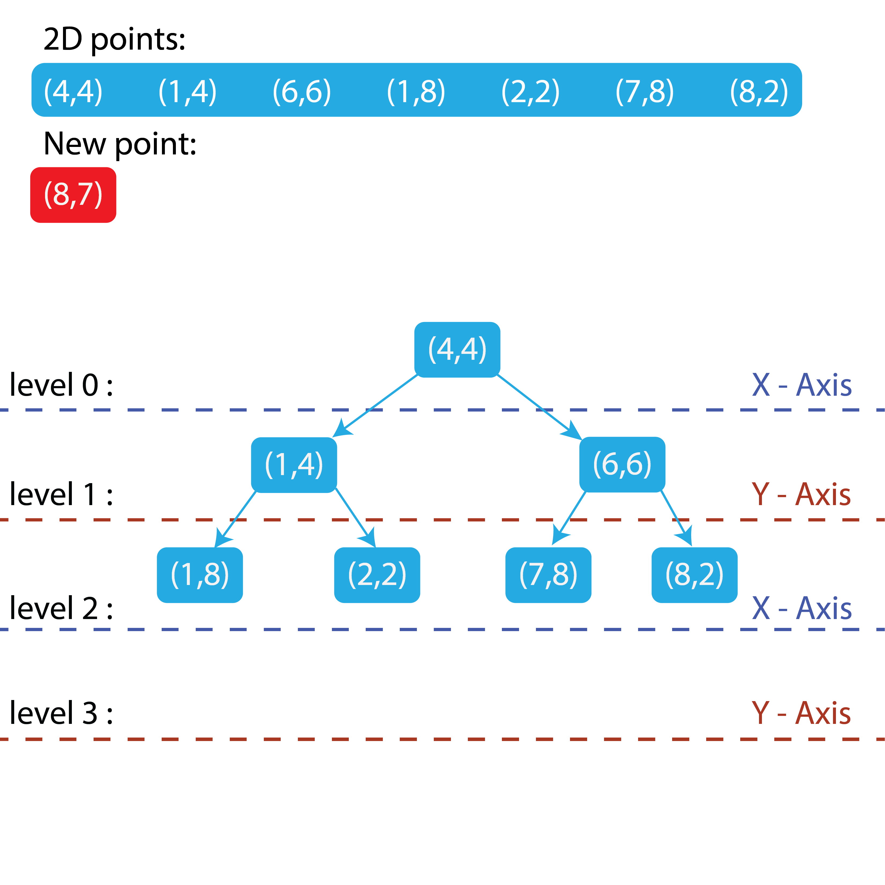
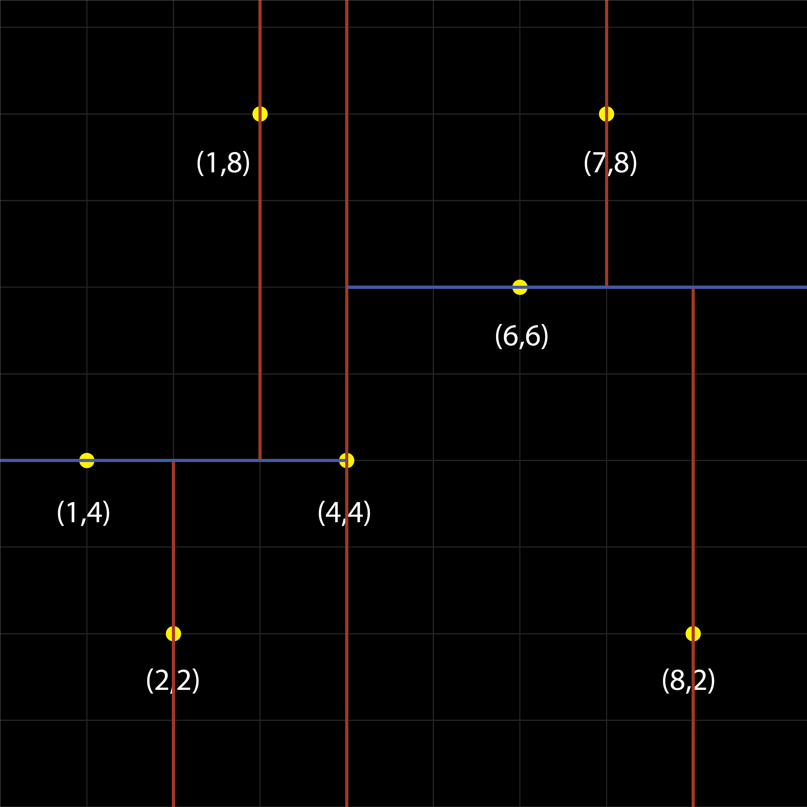

# K-D Tree - Solution for Circuit Data

Create a solution to semi-automate the Circuit runs between strobe ckt to create an optimal loss of voltage with the use of K-D Tree as the algorthim.

## Author

- [@sergrojas29](https://www.github.com/sergrojas29)

## Demo/Explanation 
### Part 1 Video Link

### Part 2 Video Link

## Description

    

<h2> Problem </h2> 

    Given a set of <b>STROBES</b> (devices used in fire alarm systems to visually notify occupants in the case of a fire) with <b>X, Y, Z</b> coordinates.

    We need to find the most optimal circuit run that will have the lowest voltage drop by connecting the closest strobe in a series.

    Then, use that circuit in a CAD drawing to create a technical drawing that can be followed in the field.

<h3>Key Points</h3>
    <ol>
        <li>
            <b>Starting location</b> - The initial node point, which is the location of the fire alarm panel.
        </li>
        <li>
            <b>Circuit run</b> - The circuit will follow from the Panel (FACP/NAC) to the closest strobe (device).
        </li>
        <li>
            Continue to the next closest device until all devices have been addressed to complete the circuit run.
        </li>
        <li>
            <i>Future implementation</i> - Circuit runs will alternate "A/B" to comply with NFPA code requirements.
        </li>
    </ol>

<figure style="height: 100%; display: flex; flex-direction: column; align-self: center; justify-content: center; ">
    
    <figcaption style="text-align:center">Diagram of Strobe -green-, Panel and circuit </figcaption>
</figure>

### Solution to Find the Closest Point in a 3D Plane Using a K-D Tree

The K-D Tree was chosen as the solution to find the closest point in a 3D plane. The "K" in K-D Tree stands for the number of dimensions the tree will serve. Since all strobes will be positioned 10 feet above the ground, they will share the same Z-coordinate.

Therefore, my implementation of the K-D Tree will be a 2D tree, as we only need to consider the X and Y coordinates for now.

* The input data will be provided via a CSV file exported from CAD. The X and Y coordinates will be fed into the algorithm and sorted.

* *Future implementation* To make the K-D Tree as balanced as possible, I will first sort the coordinates by their X-axis values before inserting them into the tree. 

* Custom Point data type to hold the X and Y data.

* Once the tree is created, it will be initialized with a starting point, which will be the location of the panel. From there:

    1. The closest point to the initial panel location will be found and removed from the data set.
    2. This closest point will then become the base for finding the next closest point.
    3. The process will continue iteratively until all points have been addressed.
    4. Each point will be saved as a string type
    4. Using these points, I will run a Python script to draw a polyline, starting from the initial panel location to each subsequent point, in order to create an optimal circuit.

## KD Tree
### What is a KD Tree? 
  
A KD Tree (k-dimensional tree) is a binary search tree used for organizing and searching points in a k-dimensional space. One of its application is performing nearest neighbor searches in k dimensions.
  

Here is an example of a KD tree: 

### How it works  

Given *N* points with dimension *K*, the tree is organized by cycling through the axes of the dimensions at each level.  

Using the example above:  

For a set of 7 points in 2 dimensions, the tree functions like a regular binary tree but alternates the axis used for comparison at each level.

* First the first point will be the root node
* From here the next point will be are organized using one dimension at a time, with the axis determined by the level of the tree (Level mod 𝐾)

For new point (8,7): *Left if Smaller And Right if Greater or equal*

Node→ Right→ Right→ Right 
Becoming a new leaf node 

This is way we can quadrant points like so: 

Create a O(logn) search at best for nearest neighbor. 

## Code

### KDTree.cpp

Defined `node` and `kdtree`

**Class `Node`**

    struct node
    {
        float x;
        float y;
        node *left;
        node *right;
    };

`node.x` : : hold coordinate x value
`node.y` : : hold coordinate y value
`node->left` : : hold pointer to create tree value
`node->right` : : hold pointer to create tree value

**Class `kdtree`**

    class kdtree
    {
    public:
        node **root;
        kdtree();
        ~kdtree(){};
        node *init_node(float x_val, float y_val);
        void insert(node *new_node);
        node *leftOrRight(node *current, node *new_node, int level); //helper function
        void insert_data(float x_val, float y_val);
        node *get_root();
        float distance(node *current, float x_val, float y_val);
        node *nearestNeighbor(node *current,float x_val, float y_val);
        void search(node *current, node *&best_node, float &best_dist, float x_val, float y_val, int level = 0);
    };

**`node **root`** : : set root node

**`kdtree()`** : : initialize kdtree

**`~kdtree(){}`** : : Deconstruct kdtree

**`node *init_node(float x_val, float y_val)`** : : returns node with  x, y values and null left and right pointers

**`void insert(node *new_node)`** : : Inserts node to kdtree

**`node *leftOrRight(node *current, node *new_node, int level)`** : : helper Function to decide where to go left or right depending on the target value.

**`void insert_data(float x_val, float y_val)`** : : Runs both `insert()` with the `init_node` as a parameter

**`node *get_root()`** : : Gets top root pointer

**`float distance(node *current, float x_val, float y_val)`** : : Euclidean distance formula

**`node *nearestNeighbor(node *current,float x_val, float y_val)`** : : Runs search to determine closest neighbor and on the way back does check to see if other branch should be checked

**`void search(node *current, node *&best_node, float &best_dist, float x_val, float y_val, int level = 0)`** : : recursive algorithm to traverse the tree 

### CircuteSearch.cpp

**Class `Point`**

    class Point
    {
    public:
        vector<float> coor;
        Point() {};
        Point(float x, float y)
        {
            coor.push_back(x);
            coor.push_back(y);
        };
        ~Point() {};
        string report()
        {
            stringstream ret;
            ret <<  "(" << coor[0] << ", " << coor[1] << ")";
            return ret.str();
        }
    };

* Create a vector if in case there are more than two points *Future Implementation* Change node to be vector to scale dimensionality 

**Class `CircuteSearch`**

* Class to run methods to recursively look for nearest neighbor 

    class CircuteSearch
    {
    public:
        vector<Point> data;
        stringstream OptimalCktInfo;
        CircuteSearch(){};
        ~CircuteSearch(){};
        string get_OptimalCktInfo();
        void getDataFromCSV(string fileLocation);
        void addpoint(Point coordinate);
        void remove(float x_val, float y_val);
        int searchLocation(float x_val, float y_val);
        void OptimalCircuit(float x_val, float y_val, int step);
        kdtree createKDTree();

    };

**`vector<Point> data;`** : : Vector of Points (Holds the list of points from each nearest neighbor)

**`stringstream OptimalCktInfo;`**: : Stringstream of Vector Points

**`CircuteSearch(){};`**: : initialize the class

**`~CircuteSearch(){};`**: : deconstruct the class

**`string get_OptimalCktInfo();`**: : return the OptimalCktInfo in a string type

**`void getDataFromCSV(string fileLocation);`**: : open read and assign coordinates to points

**`void addpoint(Point coordinate);`**: : create a point from two coordinates

**`void remove(float x_val, float y_val);`**: : go through the `data` and remove the points

**`int searchLocation(float x_val, float y_val);`**: : Helper function to index and find coordinate point returns its index

**`void OptimalCircuit(float x_val, float y_val, int step);`**: : Initializes kdtree and finds a series of the nearest neighbor returning to the cmd line the vectors in tuple format for python to run

**`kdtree createKDTree();`**: : Initialzes kdtree

## License

[MIT](https://choosealicense.com/licenses/mit/)

